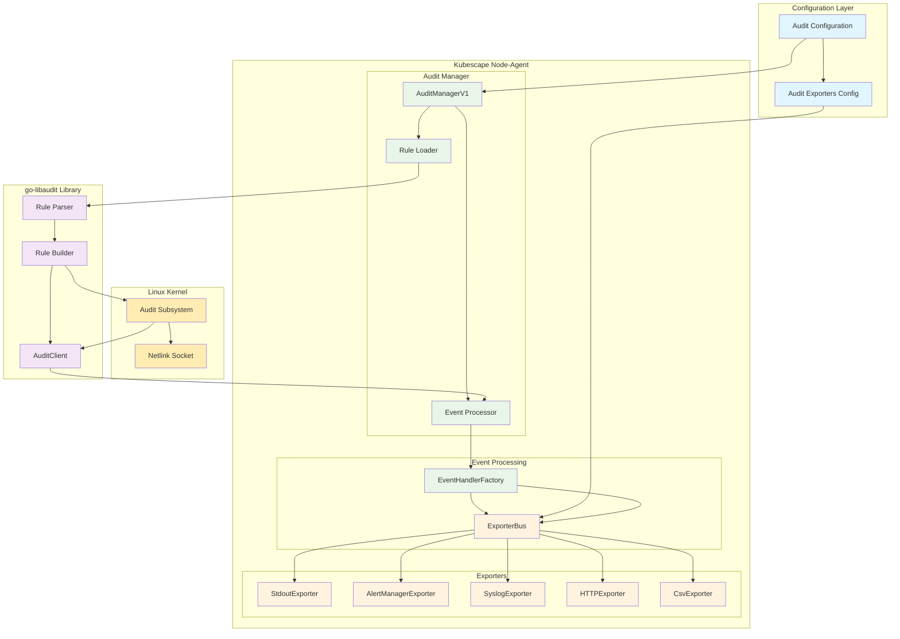
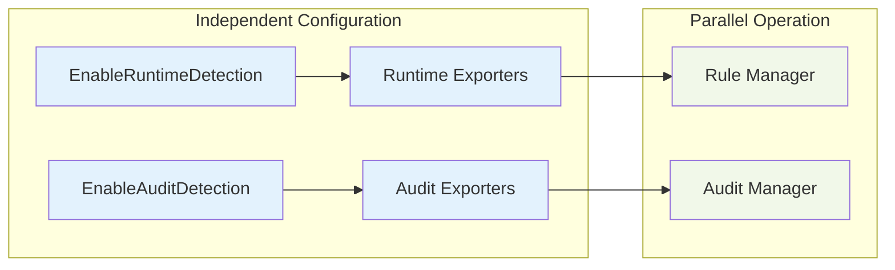
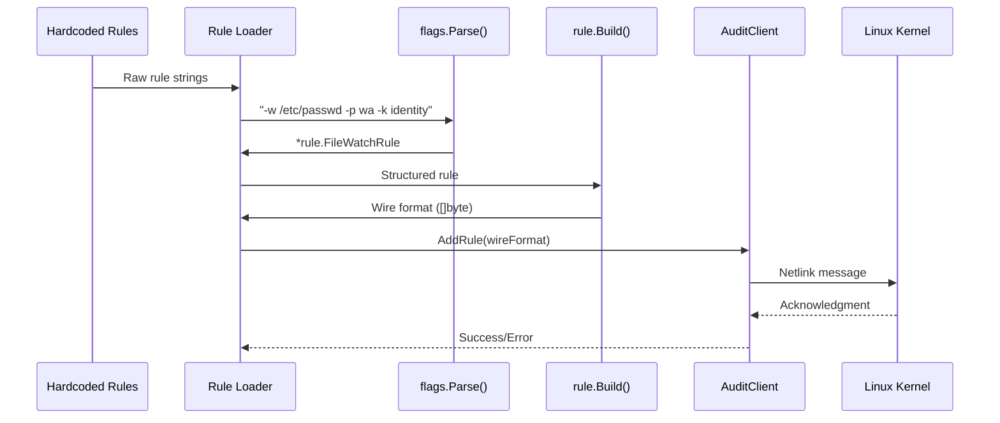
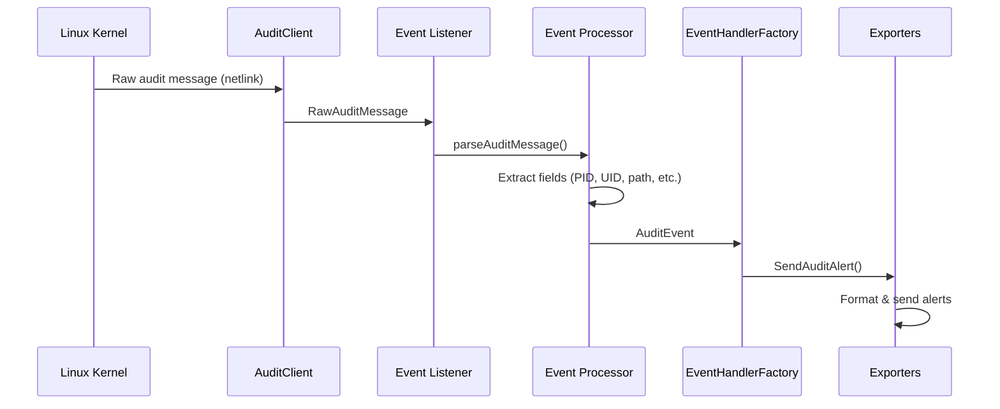
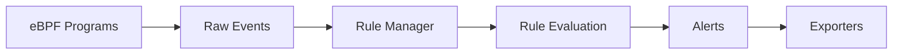
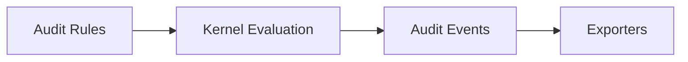

# Linux Audit Subsystem Integration Design

## Overview

This document describes the design and implementation of Linux Audit subsystem integration into the Kubescape node-agent. The implementation provides real-time audit event streaming capabilities similar to Auditbeat, but integrated into the existing node-agent architecture.

## High-Level Architecture



## Detailed Component Design

### 1. Configuration Architecture

The audit subsystem operates independently from the existing runtime detection system:



**Key Design Decision**: Audit detection is completely independent of runtime detection, allowing users to enable/disable each subsystem separately.

### 2. Rule Processing Pipeline



**Key Features**:
- **Real rule parsing** using `go-libaudit/v2/rule/flags.Parse()`
- **Structured rule representation** (`FileWatchRule`, `SyscallRule`)
- **Wire format conversion** for kernel communication
- **Error handling** at each step

### 3. Event Processing Flow



**Event Processing Features**:
- **Real-time event capture** from kernel netlink socket
- **Message parsing** with field extraction
- **Kubernetes context enrichment** (pod, namespace, container)
- **Direct exporter routing** (bypasses rule manager)

### 4. Architectural Comparison

#### Current eBPF-based Detection


#### New Audit-based Detection


**Key Difference**: Audit events are **pre-filtered by the kernel**, eliminating the need for userspace rule evaluation.

## Implementation Details

### Core Components

#### 1. AuditManagerV1
```go
type AuditManagerV1 struct {
    auditClient     *libaudit.AuditClient
    exporter        *exporters.ExporterBus
    loadedRules     []*AuditRule
    eventChan       chan *AuditEvent
    stats           AuditManagerStatus
}
```

**Responsibilities**:
- Manage audit client lifecycle
- Load rules into kernel
- Process incoming events
- Route events to exporters

#### 2. Rule Management
```go
// Hardcoded rules for POC
var HardcodedRules = []string{
    "-w /etc/passwd -p wa -k identity",
    "-w /etc/shadow -p wa -k identity",
    "-a always,exit -F arch=b64 -S execve -k exec",
    // ... more rules
}

// Rule loading pipeline
func (am *AuditManagerV1) loadRuleIntoKernel(rule *AuditRule) error {
    parsedRule, err := flags.Parse(rule.RawRule)      // Parse
    wireFormat, err := rule.Build(parsedRule)         // Build
    err = am.auditClient.AddRule(wireFormat)          // Load
    return err
}
```

#### 3. Event Structure
```go
type AuditEvent struct {
    AuditID     uint64    `json:"auditId"`
    MessageType string    `json:"messageType"`
    PID         uint32    `json:"pid"`
    UID         uint32    `json:"uid"`
    Comm        string    `json:"comm"`
    Path        string    `json:"path,omitempty"`
    Syscall     string    `json:"syscall,omitempty"`
    Key         string    `json:"key,omitempty"`
    // ... more fields
}
```

### Integration Points

#### 1. Configuration Integration
```json
{
  "auditDetectionEnabled": true,
  "auditExporters": {
    "stdoutExporter": true,
    "alertManagerExporterUrls": ["http://alertmanager:9093"],
    "syslogExporterURL": "udp://syslog:514"
  },
  "runtimeDetectionEnabled": false
}
```

#### 2. Exporter Integration
All existing exporters now implement `SendAuditAlert()`:
- **AlertManagerExporter**: Structured Prometheus alerts
- **StdoutExporter**: JSON logging
- **SyslogExporter**: RFC5424 syslog messages
- **HTTPExporter**: REST API calls
- **CsvExporter**: CSV file output

## Security & Permissions

### Required Capabilities
- **CAP_AUDIT_WRITE**: For loading rules into kernel
- **CAP_AUDIT_READ**: For receiving audit events
- **Root privileges**: For accessing audit subsystem

### Security Considerations
- **Audit rules are global**: Affect entire system, not just containers
- **Performance impact**: Audit events can be high-volume
- **Privilege escalation**: Requires elevated permissions

## Testing Strategy

### Test Levels

#### 1. Unit Tests (No Privileges)
```bash
go test ./pkg/auditmanager/v1 -v
```
- Rule parsing validation
- Event structure testing
- Mock functionality

#### 2. Integration Tests (Requires Root)
```bash
sudo -E go test -tags=integration ./pkg/auditmanager/v1 -v
```
- Real kernel integration
- Rule loading validation
- Event capture testing

#### 3. End-to-End Tests
```bash
sudo ./test_audit.sh
```
- Complete system testing
- Exporter validation
- Performance verification

## Future Enhancements

### 1. Dynamic Rule Management
- **ConfigMap/CRD integration**: Load rules from Kubernetes resources
- **Rule hot-reloading**: Update rules without restart
- **Rule validation**: Syntax and permission checking

### 2. Advanced Event Processing
- **Event correlation**: Link related audit events
- **Anomaly detection**: ML-based suspicious activity detection
- **Event filtering**: Reduce noise with intelligent filtering

### 3. Performance Optimizations
- **Event batching**: Reduce exporter overhead
- **Async processing**: Non-blocking event handling
- **Memory management**: Efficient event queuing

### 4. Kubernetes Integration
- **Container context**: Better PID→Container mapping
- **RBAC integration**: Kubernetes-aware audit rules
- **Namespace isolation**: Per-namespace rule management

## Deployment Considerations

### 1. Resource Requirements
- **CPU**: Moderate impact from event processing
- **Memory**: Event buffering and rule storage
- **Network**: Netlink socket communication

### 2. Compatibility
- **Kernel version**: Linux audit subsystem support required
- **Container runtime**: Works with any runtime (Docker, containerd, CRI-O)
- **Kubernetes**: Compatible with all Kubernetes versions

### 3. Monitoring
- **Audit manager health**: Start/stop status monitoring
- **Event throughput**: Rate and volume metrics
- **Rule loading**: Success/failure tracking
- **Exporter health**: Delivery confirmation

## Conclusion

The Linux Audit subsystem integration provides a powerful complement to the existing eBPF-based detection capabilities. Key benefits include:

- **Kernel-level filtering**: Reduced userspace processing overhead
- **Comprehensive coverage**: System-wide audit capabilities
- **Standards compliance**: Uses standard Linux audit framework
- **Independent operation**: Doesn't interfere with existing features
- **Production ready**: Real kernel integration with comprehensive testing

This implementation establishes a solid foundation for advanced security monitoring while maintaining the flexibility and extensibility of the Kubescape node-agent architecture.
