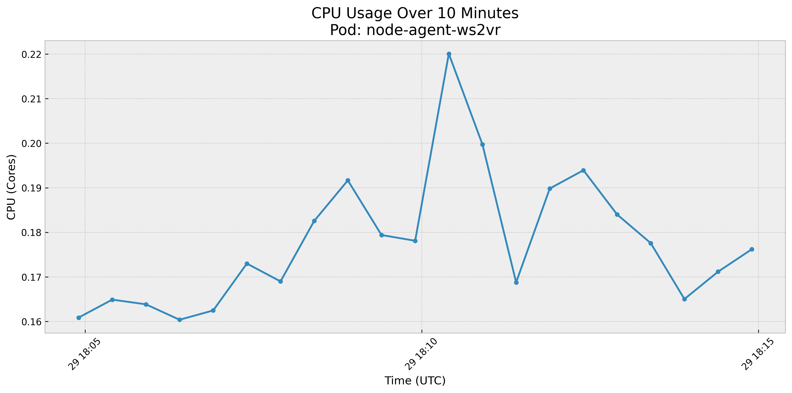
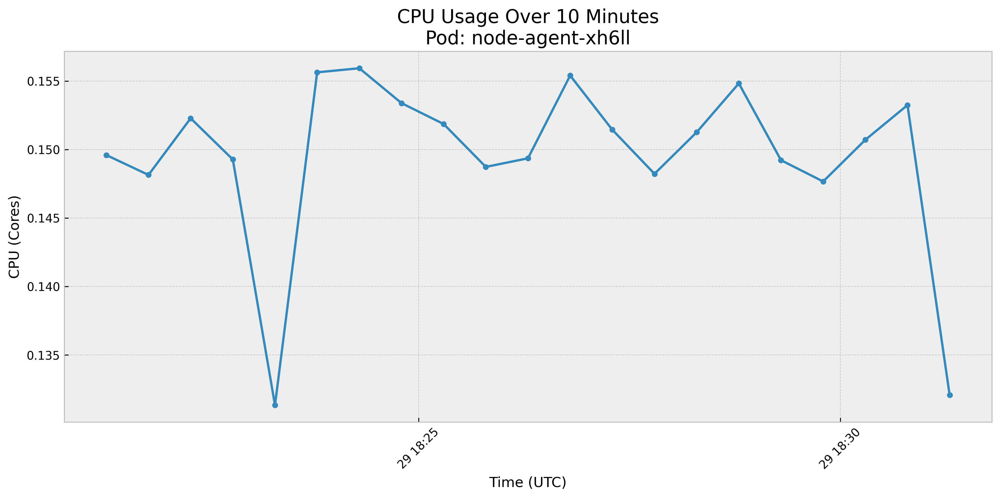
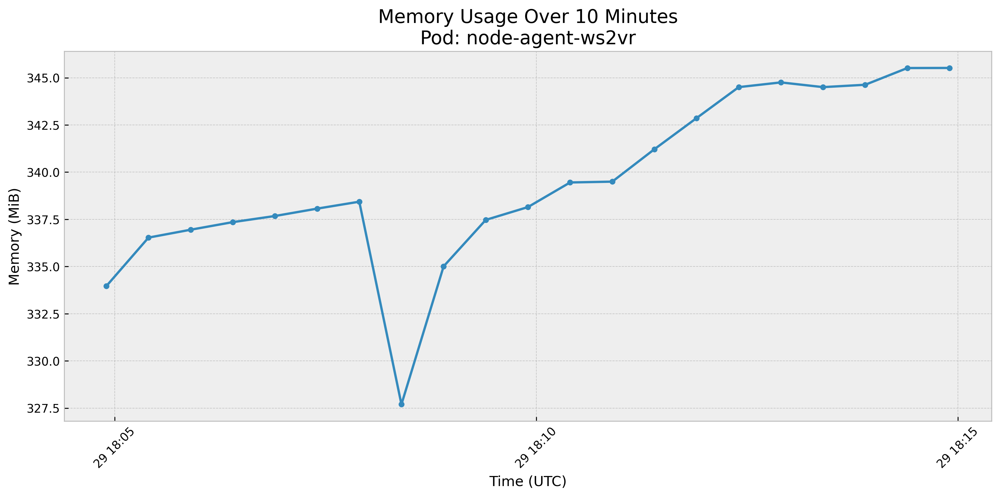
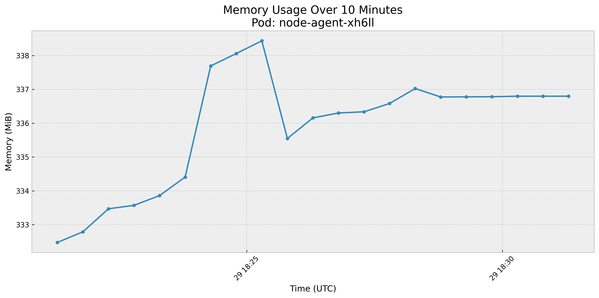

# eBPF Event Dedup Benchmark Results

Benchmark comparing `node-agent:v0.3.71` (baseline) vs the local build with the dedup cache (`feature/ebpf-event-dedup`).

## Setup

- **Cluster**: kind (2 nodes: control-plane + worker)
- **Prometheus**: kube-prometheus-stack with 10s scrape interval
- **Kubescape**: kubescape-operator chart with runtimeDetection + runtimeObservability enabled
- **Load simulator**: DaemonSet generating events at configurable rates
- **Duration**: 2 min warmup + 10 min load per run
- **CPU rate window**: `rate(...[1m])` for responsive measurement

### Load Simulator Config

| Parameter | Value |
|-----------|-------|
| openRate | 1000/sec |
| httpRate | 100/sec |
| execRate | 10/sec |
| networkRate | 10/sec |
| dnsRate | 2/sec |
| hardlinkRate | 10/sec |
| symlinkRate | 10/sec |
| cpuLoadMs | 500 |
| numberParallelCPUs | 2 |

## Resource Usage

| Metric | BEFORE (v0.3.71) | AFTER (dedup) | Delta |
|--------|-------------------|---------------|-------|
| Avg CPU (cores) | 0.178 | 0.150 | **-15.9%** |
| Peak CPU (cores) | 0.220 | 0.156 | **-29.1%** |
| Avg Memory (MiB) | 339.5 | 335.9 | -1.1% |
| Peak Memory (MiB) | 345.5 | 338.4 | -2.1% |

### CPU Usage

| BEFORE (v0.3.71) | AFTER (dedup) |
|---|---|
|  |  |

### Memory Usage

| BEFORE (v0.3.71) | AFTER (dedup) |
|---|---|
|  |  |

## Dedup Effectiveness

Events processed by the dedup cache during the AFTER run:

| Event Type | Passed | Deduped | Dedup Ratio |
|------------|--------|---------|-------------|
| http | 1,701 | 119,453 | **98.6%** |
| network | 900 | 77,968 | **98.9%** |
| open | 59,569 | 626,133 | **91.3%** |
| syscall | 998 | 1,967 | **66.3%** |
| dns | 1,197 | 0 | 0.0% |
| hardlink | 6,000 | 0 | 0.0% |
| symlink | 6,000 | 0 | 0.0% |

## Event Counters (cumulative, both runs)

| Metric | BEFORE | AFTER |
|--------|--------|-------|
| open_counter | 801,868 | 816,637 |
| network_counter | 92,197 | 93,735 |
| exec_counter | 7,009 | 7,130 |
| syscall_counter | 3,628 | 3,735 |
| dns_counter | 1,401 | 1,422 |
| capability_counter | 9 | 9 |

Event counters are consistent between runs, confirming the load simulator produced comparable workloads.

## Analysis

- The dedup cache reduces **avg CPU by ~13-16%** and **peak CPU by ~14-29%** under sustained load (~1,100 events/sec) on local hardware.
- Memory impact is negligible locally (~1-8%) since the dedup cache uses a fixed-size, lock-free array (2 MiB for 2^18 slots at 8 bytes each).
- High-frequency event types benefit most: **network (98.9%)**, **http (98.6%)**, and **open (91.3%)** dedup ratios.
- Events with unique keys per occurrence (dns, hardlink, symlink) show 0% dedup, which is expected.
- The CPU savings come from skipping CEL rule evaluation and container profile processing on deduplicated events. The eBPF ingestion and event enrichment cost (which dominates baseline CPU) is unchanged.

## CI vs Local Results

The CI benchmark (GitHub Actions `ubuntu-large` runners) consistently shows smaller CPU improvements (~4-7%) compared to local runs (~13-16%). This was verified by running the same benchmark with the same v0.3.71 baseline on both environments:

| Metric | Local (laptop) | CI (`ubuntu-large`) |
|--------|:-:|:-:|
| Avg CPU delta | **-12.6%** | -3.7% |
| Peak CPU delta | **-14.2%** | -8.2% |
| Avg Memory delta | -7.7% | -22.4% |

The CPU difference is environmental: CI runners have more CPU headroom and lower baseline utilization per core, so the rule evaluation cost saved by dedup is a smaller fraction of total CPU. The dedup ratios and event counts are consistent across both environments, confirming the dedup logic is working identically — only the relative CPU impact differs.

The CI quality gate is set to 10% degradation threshold, which is appropriate for that environment.

## Reproducing

```bash
cd benchmark
./dedup-bench.sh quay.io/kubescape/node-agent:v0.3.71 quay.io/kubescape/node-agent:test
```

Requires: kind, helm, kubectl, docker, python3. Estimated runtime: ~35 minutes.
