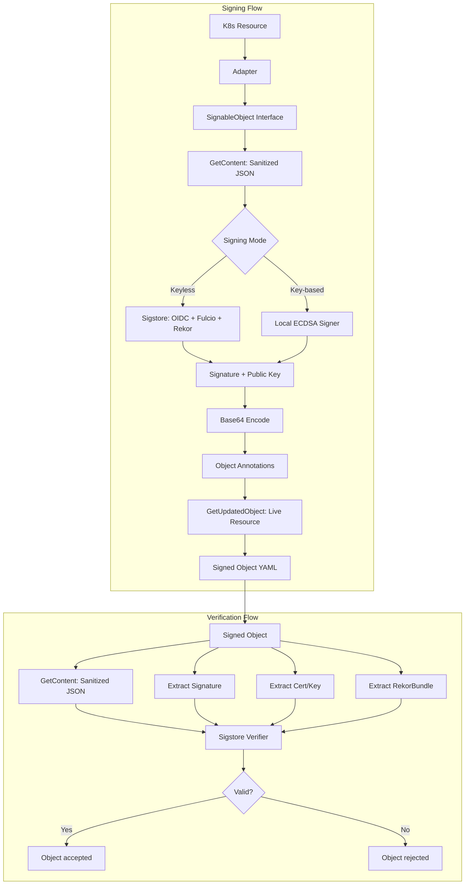
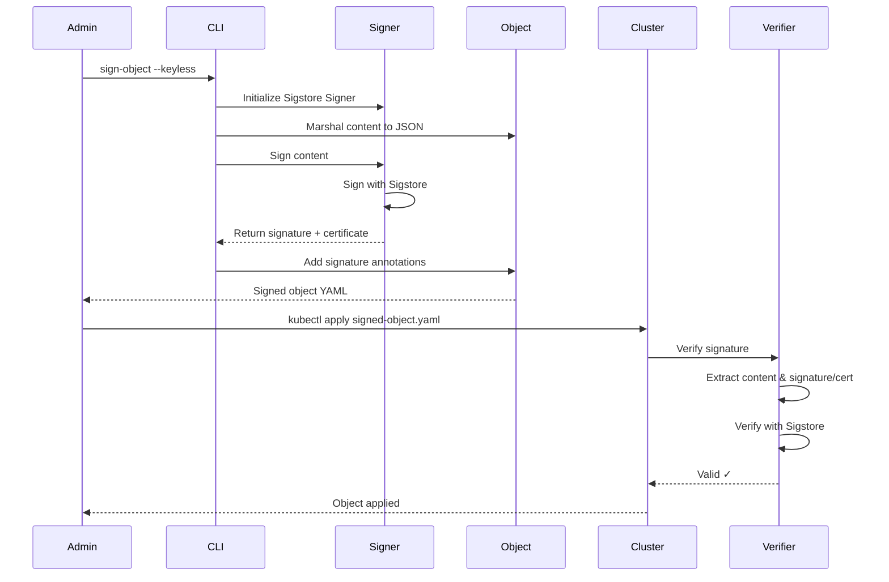

# Object Signing Documentation

## Overview

The node-agent supports cryptographic signing of Kubernetes objects (profiles and rules) to ensure their integrity and authenticity. This feature uses signatures compatible with the **Sigstore/Cosign** ecosystem, leveraging official `sigstore/sigstore`, `sigstore/cosign`, and `sigstore/sigstore-go` libraries for robust blob signing and verification.

Signed objects can be:
- **ApplicationProfiles** - defining allowed application behavior
- **SeccompProfiles** - defining allowed syscalls
- **NetworkNeighborhoods** - defining allowed network traffic
- **Rules** - defining security rules for the Rule Manager
- Any future object types that implement the `SignableObject` interface

## Why Sign Objects?

1. **Integrity** - Detect if an object has been tampered with
2. **Authenticity** - Verify who created the object
3. **Trust** - Establish a chain of trust for security policies
4. **Audit** - Track who signed what and when

## Signature Verification

The node-agent can automatically verify signatures when loading objects. This ensures that only trusted policies are enforced.

### Enabling Verification

Set the `enableSignatureVerification` configuration flag:

```yaml
# config.json
{
  "enableSignatureVerification": true
}
```

Or via environment variable:

```bash
export ENABLE_SIGNATURE_VERIFICATION=true
```

**Default:** `false` (verification disabled for backward compatibility)

### Verification Behavior

When verification is enabled:

1. **ApplicationProfiles**: Verified in the ApplicationProfileCache when fetched from storage.
2. **SeccompProfiles**: Verified when fetched from storage.
3. **NetworkNeighborhoods**: Verified in the NetworkNeighborhoodCache when fetched from storage.
4. **Rules**: Verified by the RulesWatcher when syncing from the cluster.

On **verification failure**:
- Object is **skipped** (not loaded or processed)
- Warning is logged with object namespace, name, and error
- Enforcement continues (doesn't crash the agent)

This ensures security while maintaining availability - if an object can't be verified, the node-agent continues operating with other valid objects.

## Architecture

### Canonical Hashing

To ensure the signature remains valid regardless of minor YAML formatting differences or the presence of the signature itself, we use **Canonical Hashing**.

1. **Sanitization**: Before hashing, the object is "sanitized" by creating a copy that excludes the `metadata.annotations`, `metadata.managedFields`, and the `status` block.
2. **Canonical JSON**: The sanitized object is marshaled to JSON.
3. **Hashing**: We use `github.com/kubescape/storage/pkg/utils.CanonicalHash` which performs a specialized SHA-256 hash of the JSON.

**Key Finding:** `CanonicalHash` includes all fields in its input. Therefore, the **sanitization step is mandatory** to prevent a circular dependency where adding the signature annotation changes the hash and invalidates the signature.

### Diagram


## Annotation Format

Signed objects store signature information in these annotations:

```yaml
metadata:
  annotations:
    signature.kubescape.io/signature: "base64-encoded-signature"
    signature.kubescape.io/certificate: "base64-encoded-cert-or-pubkey"
    signature.kubescape.io/rekor-bundle: "base64-encoded-rekor-bundle"
    signature.kubescape.io/issuer: "https://token.actions.githubusercontent.com"
    signature.kubescape.io/identity: "kubernetes.io"
    signature.kubescape.io/timestamp: "1709894400"
```

### Annotation Keys

| Key | Description | Example |
|-----|-------------|---------|
| `signature.kubescape.io/signature` | Base64-encoded ECDSA signature | `MEUCIQD...` |
| `signature.kubescape.io/certificate` | Base64-encoded x509 cert or public key | `MFkwEwY...` |
| `signature.kubescape.io/rekor-bundle` | Base64-encoded Rekor transparency log bundle | `eyJzaWdu...` |
| `signature.kubescape.io/issuer` | OIDC issuer (for keyless) | `https://token.actions.githubusercontent.com` |
| `signature.kubescape.io/identity` | Signing identity | `kubernetes.io` or `local-key` |
| `signature.kubescape.io/timestamp` | Unix timestamp of signing | `1709894400` |

## Signing Modes

### Keyless Signing (Recommended)

Uses OIDC identity providers like GitHub Actions, Google, or Kubernetes. No need to manage private keys.

```bash
sign-object \
  --keyless \
  --file my-app-profile.yaml \
  --output signed-profile.yaml
```

**Advantages:**
- No private key management
- Built-in identity verification
- Compatible with CI/CD pipelines
- Audit trail from OIDC providers

### Key-Based Signing

Uses a locally generated ECDSA P-256 key pair. Useful for:
- Offline signing
- Air-gapped environments
- Testing and development

```bash
# Generate a key pair (one-time)
sign-object generate-keypair --output my-key-pair.pem

# Sign with the key
sign-object \
  --key my-key-pair.pem \
  --file my-app-profile.yaml \
  --output signed-profile.yaml
```

## CLI Reference

### Installation

```bash
# Build from source
cd cmd/sign-object
go build -o sign-object

# Or install globally
go install github.com/kubescape/node-agent/cmd/sign-object@latest
```

### Commands

#### `sign-object [sign]`

Sign a Kubernetes object.

```bash
sign-object [sign] [flags]
```

**Flags:**

| Flag | Type | Default | Description |
|------|------|---------|-------------|
| `--file` | string | required | Input object YAML file |
| `--output` | string | required | Output file for signed object |
| `--keyless` | bool | false | Use keyless signing (OIDC) |
| `--key` | string | - | Path to private key file |
| `--type` | string | auto | Object type: `applicationprofile`, `seccompprofile`, `networkneighborhood`, `rules`, or `auto` |
| `--verbose` | bool | false | Enable verbose logging |

**Examples:**

```bash
# Sign with keyless (OIDC)
sign-object --keyless --file app-profile.yaml --output signed-app-profile.yaml

# Sign with local key
sign-object --key my-key.pem --file seccomp-profile.yaml --output signed-seccomp.yaml

# Sign Rules CRD
sign-object --keyless --file rules.yaml --output signed-rules.yaml

# Auto-detect object type
sign-object --keyless --file object.yaml --output signed.yaml

# Specify object type explicitly
sign-object --keyless --type seccompprofile --file profile.yaml --output signed.yaml
```

#### `sign-object verify`

Verify a signed object's signature.

```bash
sign-object verify [flags]
```

**Flags:**

| Flag | Type | Default | Description |
|------|------|---------|-------------|
| `--file` | string | required | Signed object YAML file |
| `--type` | string | auto | Object type: `applicationprofile`, `seccompprofile`, `networkneighborhood`, `rules`, or `auto` |
| `--strict` | bool | true | Require trusted issuer/identity |
| `--verbose` | bool | false | Enable verbose logging |

**Examples:**

```bash
# Verify with strict checking (keyless must have issuer/identity)
sign-object verify --file signed-object.yaml

# Allow untrusted local signatures
sign-object verify --file signed-object.yaml --strict=false
```

#### `sign-object generate-keypair`

Generate a new ECDSA P-256 key pair for local signing.

```bash
sign-object generate-keypair [flags]
```

**Flags:**

| Flag | Type | Default | Description |
|------|------|---------|-------------|
| `--output` | string | - | Path for the private key file (writes `FILE` for private key and `FILE.pub` for public key) |
| `--public-only` | bool | false | Only write the public key (writes only to `FILE`, no `.pub` suffix) |

**Examples:**

```bash
# Generate full key pair
sign-object generate-keypair --output my-signing-key.pem

# Generate only public key (for verification only)
sign-object generate-keypair --public-only --output public-key.pem
```

#### `sign-object extract-signature`

Extract signature information from a signed object.

```bash
sign-object extract-signature [flags]
```

**Flags:**

| Flag | Type | Default | Description |
|------|------|---------|-------------|
| `--file` | string | required | Signed object YAML file |
| `--type` | string | auto | Object type: `applicationprofile`, `seccompprofile`, `networkneighborhood`, `rules`, or `auto` |
| `--json` | bool | false | Output as JSON |

**Examples:**

```bash
# Display signature info
sign-object extract-signature --file signed-object.yaml

# Output as JSON for scripting
sign-object extract-signature --file signed-object.yaml --json
```

## Complete Workflow

### Example 1: Sign ApplicationProfile with Keyless

```bash
# 1. Create your ApplicationProfile
cat > my-app-profile.yaml << 'EOF'
apiVersion: softwarecomposition.kubescape.io/v1beta1
kind: ApplicationProfile
metadata:
  name: nginx-profile
  namespace: default
spec:
  architectures:
  - amd64
  containers:
  - name: nginx
    capabilities:
    - CAP_NET_BIND_SERVICE
    execs:
    - path: /usr/sbin/nginx
EOF

# 2. Sign with keyless
sign-object --keyless \
  --file my-app-profile.yaml \
  --output signed-app-profile.yaml

# 3. Apply to cluster
kubectl apply -f signed-app-profile.yaml

# 4. Verify anytime
sign-object verify --file signed-app-profile.yaml
```

### Example 2: Sign SeccompProfile with Local Key

```bash
# 1. Generate key pair
sign-object generate-keypair --output seccomp-signing-key.pem

# 2. Create SeccompProfile
cat > my-seccomp-profile.yaml << 'EOF'
apiVersion: softwarecomposition.kubescape.io/v1beta1
kind: SeccompProfile
metadata:
  name: strict-seccomp
  namespace: default
spec:
  containers:
  - name: app-container
EOF

# 3. Sign with local key
sign-object --key seccomp-signing-key.pem \
  --file my-seccomp-profile.yaml \
  --output signed-seccomp-profile.yaml

# 4. Verify
sign-object verify --file signed-seccomp-profile.yaml
```

### Example 3: Sign Rules CRD

```bash
# 1. Create Rules CRD
cat > my-rules.yaml << 'EOF'
apiVersion: kubescape.io/v1
kind: Rules
metadata:
  name: my-security-rules
  namespace: kubescape
spec:
  rules:
  - id: R0001
    enabled: true
    name: "Suspicious Exec"
    parameters:
      paths: ["/bin/bash"]
EOF

# 2. Sign with keyless
sign-object --keyless \
  --file my-rules.yaml \
  --output signed-rules.yaml

# 3. Verify
sign-object verify --file signed-rules.yaml
```

### Example 4: Sign NetworkNeighborhood with Keyless

```bash
# 1. Create NetworkNeighborhood
cat > my-nn.yaml << 'EOF'
apiVersion: softwarecomposition.kubescape.io/v1beta1
kind: NetworkNeighborhood
metadata:
  name: nginx-nn
  namespace: default
spec:
  containers:
  - name: nginx
    egress:
    - identifier: "dns:8.8.8.8"
      ipAddress: "8.8.8.8"
      ports:
      - port: 53
        protocol: UDP
EOF

# 2. Sign with keyless
sign-object --keyless \
  --file my-nn.yaml \
  --output signed-nn.yaml

# 3. Verify
sign-object verify --file signed-nn.yaml
```

### Example 5: Batch Signing in CI/CD

```yaml
# .github/workflows/sign-objects.yml
name: Sign Security Objects

on:
  push:
    paths:
      - 'policies/**.yaml'

jobs:
  sign:
    runs-on: ubuntu-latest
    permissions:
      id-token: write
      contents: read

    steps:
      - uses: actions/checkout@v4

      - name: Install sign-object
        run: |
          cd cmd/sign-object
          go build -o sign-object

      - name: Sign Objects
        run: |
          for obj in policies/*.yaml; do
            ./sign-object --keyless \
              --file "$obj" \
              --output "signed/$(basename $obj)"
          done

      - name: Verify all signed objects
        run: |
          for obj in signed/*.yaml; do
            ./sign-object verify --file "$obj"
          done

      - name: Upload signed objects
        uses: actions/upload-artifact@v4
        with:
          name: signed-objects
          path: signed/*.yaml
```

## Security Model



## Threat Model

| Threat | Mitigation |
|--------|------------|
| Object tampering | ECDSA signature verification |
| Impersonation | OIDC identity verification (keyless) |
| Key compromise | Short-lived keys, rotation support |
| Replay attacks | Timestamps, uniqueness checks |
| Man-in-the-middle | Certificate pinning, verification |

## Best Practices

1. **Enable Verification in Production**
    - Set `enableSignatureVerification: true` in node-agent config
    - Objects failing verification are skipped with warnings
    - Doesn't crash the agent - maintains availability

2. **Use Keyless Signing in Production**
    - No private keys to manage
    - Built-in identity from GitHub Actions/Google/Kubernetes
    - Transparent, auditable signing process

3. **Sign Before Applying**
    - Always verify signatures before applying to clusters
    - Enable cache verification in node-agent for automatic validation
    - Consider admission controller to enforce verification

4. **Version Your Objects**
   - Include version in metadata
   - Old signatures become invalid on content changes

5. **Key Management for Local Signing**
   - Store keys in secure locations (HSM, KMS)
   - Rotate keys regularly
   - Use read-only keys for verification

6. **Audit Trail**
   - Store signing timestamps
   - Track who signed what
   - Use GitHub Actions for audit logs

## Troubleshooting

### Verification Fails

```bash
# Check if object was modified
sign-object extract-signature --file object.yaml

# Verify with verbose output
sign-object verify --file object.yaml --verbose
```

### Missing Annotation

```bash
# This error means no signature annotation found
# Ensure you're using the signed version of the object
```

### OIDC Token Issues

```bash
# For keyless signing, ensure OIDC token is available
# In GitHub Actions: permissions: id-token: write
# In local environment: configure gcloud or kubectl
```

## Integration with Admission Controllers

For clusters that require verified objects, use an admission webhook:

```yaml
apiVersion: admissionregistration.k8s.io/v1
kind: ValidatingWebhookConfiguration
metadata:
  name: object-signature-verifier
webhooks:
- name: verify-object-signature.kubescape.io
  rules:
  - apiGroups: ["softwarecomposition.kubescape.io"]
    apiVersions: ["v1beta1"]
    operations: ["CREATE", "UPDATE"]
    resources: ["applicationprofiles", "seccompprofiles"]
  - apiGroups: ["kubescape.io"]
    apiVersions: ["v1"]
    operations: ["CREATE", "UPDATE"]
    resources: ["rules"]
  sideEffects: None
  admissionReviewVersions: ["v1"]
```

The webhook would:
1. Extract signature from annotations
2. Verify signature against object content
3. Reject if signature invalid or missing

## Key Files

| `pkg/signature/interface.go` | SignableObject interface and Signature struct |
| `pkg/signature/cosign_adapter.go` | Sigstore/Cosign signing and verification |
| `pkg/signature/sign.go` | Public signing API and annotation encoding |
| `pkg/signature/verify.go` | Public verification API and cache integration |
| `pkg/signature/profiles/applicationprofile_adapter.go` | ApplicationProfile adapter |
| `pkg/signature/profiles/seccompprofile_adapter.go` | SeccompProfile adapter |
| `pkg/signature/profiles/networkneighborhood_adapter.go` | NetworkNeighborhood adapter |
| `pkg/signature/profiles/rules_adapter.go` | Rules adapter |
| `cmd/sign-object/main.go` | CLI tool for object signing |

## Additional Resources

- [Sigstore Documentation](https://docs.sigstore.dev/)
- [Cosign Project](https://github.com/sigstore/cosign)
- [Kubernetes Security Best Practices](https://kubernetes.io/docs/concepts/security/)
- [OIDC for Kubernetes](https://kubernetes.io/docs/reference/access-authn-authz/authentication/#openid-connect-tokens)
