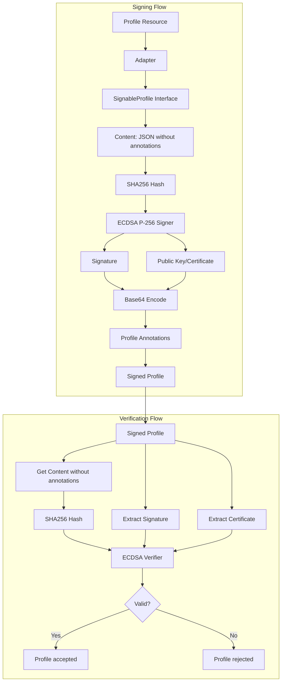
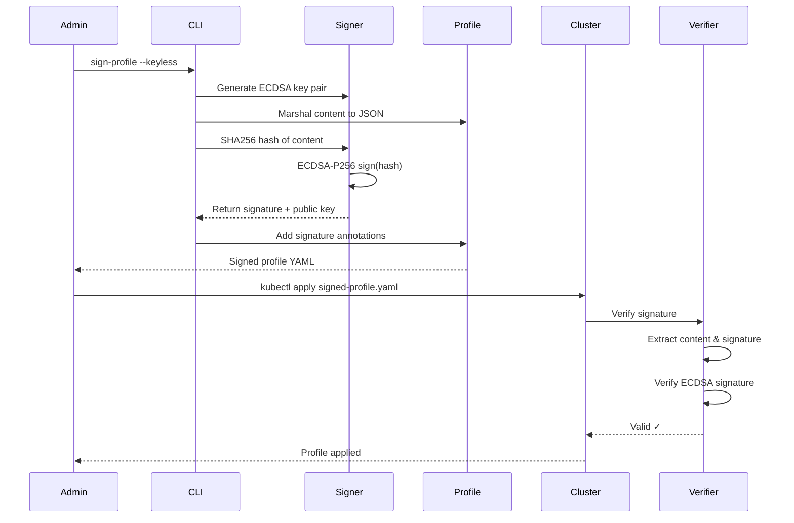

# Profile Signing Documentation

## Overview

The node-agent supports cryptographic signing of Kubernetes profiles to ensure their integrity and authenticity. This feature uses ECDSA P-256 signatures compatible with the Sigstore/Cosign ecosystem.

Signed profiles can be:
- **ApplicationProfiles** - defining allowed application behavior
- **SeccompProfiles** - defining allowed syscalls
- Any future profile types that implement the `SignableProfile` interface

## Why Sign Profiles?

1. **Integrity** - Detect if a profile has been tampered with
2. **Authenticity** - Verify who created the profile
3. **Trust** - Establish a chain of trust for security policies
4. **Audit** - Track who signed what and when

## Cache Verification

The ApplicationProfileCache can automatically verify signatures when loading profiles. This ensures that only trusted profiles are used for policy enforcement.

### Enabling Verification

Set the `enableProfileVerification` configuration flag:

```yaml
# config.json
{
  "enableProfileVerification": true
}
```

Or via environment variable:

```bash
export ENABLE_PROFILE_VERIFICATION=true
```

**Default:** `false` (verification disabled for backward compatibility)

### Verification Behavior

When verification is enabled:

1. **Normal Profiles**: Verified when fetched in `updateAllProfiles`
2. **User-Managed Profiles**: Verified when fetched in `handleUserManagedProfile`
3. **User-Defined Profiles**: Verified when fetched in `addContainer`

On **verification failure**:
- Profile is **skipped** (not loaded into cache)
- Warning is logged with profile namespace, name, and error
- Enforcement continues (doesn't crash the agent)

This ensures security while maintaining availability - if a profile can't be verified, the node-agent continues operating with other valid profiles.

## Architecture



## Annotation Format

Signed profiles store signature information in these annotations:

```yaml
metadata:
  annotations:
    signature.kubescape.io/signature: "base64-encoded-signature"
    signature.kubescape.io/certificate: "base64-encoded-public-key"
    signature.kubescape.io/issuer: "https://token.actions.githubusercontent.com"
    signature.kubescape.io/identity: "kubernetes.io"
    signature.kubescape.io/timestamp: "1709894400"
```

### Annotation Keys

| Key | Description | Example |
|-----|-------------|---------|
| `signature.kubescape.io/signature` | Base64-encoded ECDSA signature | `MEUCIQD...` |
| `signature.kubescape.io/certificate` | Base64-encoded public key (PEM) | `MFkwEwY...` |
| `signature.kubescape.io/issuer` | OIDC issuer (for keyless) | `https://token.actions.githubusercontent.com` |
| `signature.kubescape.io/identity` | Signing identity | `kubernetes.io` or `local-key` |
| `signature.kubescape.io/timestamp` | Unix timestamp of signing | `1709894400` |

## Signing Modes

### Keyless Signing (Recommended)

Uses OIDC identity providers like GitHub Actions, Google, or Kubernetes. No need to manage private keys.

```bash
sign-profile \
  --keyless \
  --file my-app-profile.yaml \
  --output signed-profile.yaml
```

**Advantages:**
- No private key management
- Built-in identity verification
- Compatible with CI/CD pipelines
- Audit trail from OIDC providers

### Key-Based Signing

Uses a locally generated ECDSA P-256 key pair. Useful for:
- Offline signing
- Air-gapped environments
- Testing and development

```bash
# Generate a key pair (one-time)
sign-profile generate-keypair --output my-key-pair.pem

# Sign with the key
sign-profile \
  --key my-key-pair.pem \
  --file my-app-profile.yaml \
  --output signed-profile.yaml
```

## CLI Reference

### Installation

```bash
# Build from source
cd cmd/sign-profile
go build -o sign-profile

# Or install globally
go install github.com/kubescape/node-agent/cmd/sign-profile@latest
```

### Commands

#### `sign-profile [sign]`

Sign a profile resource.

```bash
sign-profile [sign] [flags]
```

**Flags:**

| Flag | Type | Default | Description |
|------|------|---------|-------------|
| `--file` | string | required | Input profile YAML file |
| `--output` | string | required | Output file for signed profile |
| `--keyless` | bool | false | Use keyless signing (OIDC) |
| `--key` | string | - | Path to private key file |
| `--type` | string | auto | Profile type: `applicationprofile`, `seccompprofile`, or `auto` |
| `--verbose` | bool | false | Enable verbose logging |

**Examples:**

```bash
# Sign with keyless (OIDC)
sign-profile --keyless --file app-profile.yaml --output signed-app-profile.yaml

# Sign with local key
sign-profile --key my-key.pem --file seccomp-profile.yaml --output signed-seccomp.yaml

# Auto-detect profile type
sign-profile --keyless --file profile.yaml --output signed.yaml

# Specify profile type explicitly
sign-profile --keyless --type seccompprofile --file profile.yaml --output signed.yaml
```

#### `sign-profile verify`

Verify a signed profile's signature.

```bash
sign-profile verify [flags]
```

**Flags:**

| Flag | Type | Default | Description |
|------|------|---------|-------------|
| `--file` | string | required | Signed profile YAML file |
| `--strict` | bool | true | Require trusted issuer/identity |
| `--verbose` | bool | false | Enable verbose logging |

**Examples:**

```bash
# Verify with strict checking (keyless must have issuer/identity)
sign-profile verify --file signed-profile.yaml

# Allow untrusted local signatures
sign-profile verify --file signed-profile.yaml --strict=false
```

#### `sign-profile generate-keypair`

Generate a new ECDSA P-256 key pair for local signing.

```bash
sign-profile generate-keypair [flags]
```

**Flags:**

| Flag | Type | Default | Description |
|------|------|---------|-------------|
| `--output` | string | - | Output PEM file (contains both keys) |
| `--public-only` | bool | false | Only output public key |

**Examples:**

```bash
# Generate full key pair
sign-profile generate-keypair --output my-signing-key.pem

# Generate only public key (for verification only)
sign-profile generate-keypair --public-only --output public-key.pem
```

#### `sign-profile extract-signature`

Extract signature information from a signed profile.

```bash
sign-profile extract-signature [flags]
```

**Flags:**

| Flag | Type | Default | Description |
|------|------|---------|-------------|
| `--file` | string | required | Signed profile YAML file |
| `--json` | bool | false | Output as JSON |

**Examples:**

```bash
# Display signature info
sign-profile extract-signature --file signed-profile.yaml

# Output as JSON for scripting
sign-profile extract-signature --file signed-profile.yaml --json
```

## Complete Workflow

### Example 1: Sign ApplicationProfile with Keyless

```bash
# 1. Create your ApplicationProfile
cat > my-app-profile.yaml << 'EOF'
apiVersion: softwarecomposition.kubescape.io/v1beta1
kind: ApplicationProfile
metadata:
  name: nginx-profile
  namespace: default
spec:
  architectures:
  - amd64
  containers:
  - name: nginx
    capabilities:
    - CAP_NET_BIND_SERVICE
    execs:
    - path: /usr/sbin/nginx
EOF

# 2. Sign with keyless
sign-profile --keyless \
  --file my-app-profile.yaml \
  --output signed-app-profile.yaml

# 3. Apply to cluster
kubectl apply -f signed-app-profile.yaml

# 4. Verify anytime
sign-profile verify --file signed-app-profile.yaml
```

### Example 2: Sign SeccompProfile with Local Key

```bash
# 1. Generate key pair
sign-profile generate-keypair --output seccomp-signing-key.pem

# 2. Create SeccompProfile
cat > my-seccomp-profile.yaml << 'EOF'
apiVersion: softwarecomposition.kubescape.io/v1beta1
kind: SeccompProfile
metadata:
  name: strict-seccomp
  namespace: default
spec:
  containers:
  - name: app容器
EOF

# 3. Sign with local key
sign-profile --key seccomp-signing-key.pem \
  --file my-seccomp-profile.yaml \
  --output signed-seccomp-profile.yaml

# 4. Verify
sign-profile verify --file signed-seccomp-profile.yaml
```

### Example 3: Batch Signing in CI/CD

```yaml
# .github/workflows/sign-profiles.yml
name: Sign Security Profiles

on:
  push:
    paths:
      - 'profiles/**.yaml'

jobs:
  sign:
    runs-on: ubuntu-latest
    permissions:
      id-token: write
      contents: read

    steps:
      - uses: actions/checkout@v4

      - name: Install sign-profile
        run: |
          cd cmd/sign-profile
          go build -o sign-profile

      - name: Sign ApplicationProfiles
        run: |
          for profile in profiles/*application*.yaml; do
            ./sign-profile --keyless \
              --file "$profile" \
              --output "signed/$(basename $profile)"
          done

      - name: Sign SeccompProfiles
        run: |
          for profile in profiles/*seccomp*.yaml; do
            ./sign-profile --keyless \
              --file "$profile" \
              --output "signed/$(basename $profile)"
          done

      - name: Verify all signed profiles
        run: |
          for profile in signed/*.yaml; do
            ./sign-profile verify --file "$profile"
          done

      - name: Upload signed profiles
        uses: actions/upload-artifact@v4
        with:
          name: signed-profiles
          path: signed/*.yaml
```

## Security Model



## Threat Model

| Threat | Mitigation |
|--------|------------|
| Profile tampering | ECDSA signature verification |
| Impersonation | OIDC identity verification (keyless) |
| Key compromise | Short-lived keys, rotation support |
| Replay attacks | Timestamps, uniqueness checks |
| Man-in-the-middle | Certificate pinning, verification |

## Best Practices

1. **Enable Verification in Production**
    - Set `enableProfileVerification: true` in node-agent config
    - Profiles failing verification are skipped with warnings
    - Doesn't crash the agent - maintains availability

2. **Use Keyless Signing in Production**
    - No private keys to manage
    - Built-in identity from GitHub Actions/Google/Kubernetes
    - Transparent, auditable signing process

2. **Sign Before Applying**
    - Always verify signatures before applying to clusters
    - Enable cache verification in node-agent for automatic validation
    - Consider admission controller to enforce verification

3. **Version Your Profiles**
   - Include version in metadata
   - Old signatures become invalid on content changes

4. **Key Management for Local Signing**
   - Store keys in secure locations (HSM, KMS)
   - Rotate keys regularly
   - Use read-only keys for verification

5. **Audit Trail**
   - Store signing timestamps
   - Track who signed what
   - Use GitHub Actions for audit logs

## Troubleshooting

### Verification Fails

```bash
# Check if profile was modified
sign-profile extract-signature --file profile.yaml

# Verify with verbose output
sign-profile verify --file profile.yaml --verbose
```

### Missing Annotation

```bash
# This error means no signature annotation found
# Ensure you're using the signed version of the profile
```

### OIDC Token Issues

```bash
# For keyless signing, ensure OIDC token is available
# In GitHub Actions: permissions: id-token: write
# In local environment: configure gcloud or kubectl
```

## Integration with Admission Controllers

For clusters that require verified profiles, use an admission webhook:

```yaml
apiVersion: admissionregistration.k8s.io/v1
kind: ValidatingWebhookConfiguration
metadata:
  name: profile-signature-verifier
webhooks:
- name: verify-profile-signature.kubescape.io
  rules:
  - apiGroups: ["softwarecomposition.kubescape.io"]
    apiVersions: ["v1beta1"]
    operations: ["CREATE", "UPDATE"]
    resources: ["applicationprofiles", "seccompprofiles"]
  sideEffects: None
  admissionReviewVersions: ["v1"]
```

The webhook would:
1. Extract signature from annotations
2. Verify signature against profile content
3. Reject if signature invalid or missing

## Key Files

| File | Description |
|------|-------------|
| `pkg/signature/interface.go` | SignableProfile interface |
| `pkg/signature/cosign_adapter.go` | ECDSA signing/verification |
| `pkg/signature/sign.go` | Public signing API |
| `pkg/signature/verify.go` | Public verification API |
| `pkg/signature/profiles/applicationprofile_adapter.go` | ApplicationProfile adapter |
| `pkg/signature/profiles/seccompprofile_adapter.go` | SeccompProfile adapter |
| `cmd/sign-profile/main.go` | CLI tool |

## Additional Resources

- [Sigstore Documentation](https://docs.sigstore.dev/)
- [Cosign Project](https://github.com/sigstore/cosign)
- [Kubernetes Security Best Practices](https://kubernetes.io/docs/concepts/security/)
- [OIDC for Kubernetes](https://kubernetes.io/docs/reference/access-authn-authz/authentication/#openid-connect-tokens)